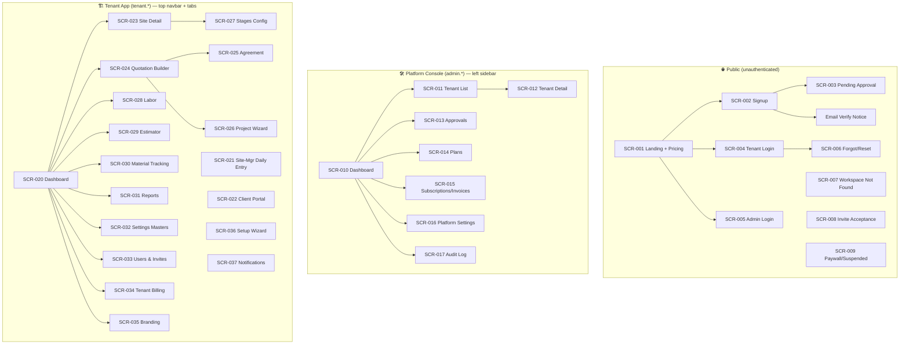
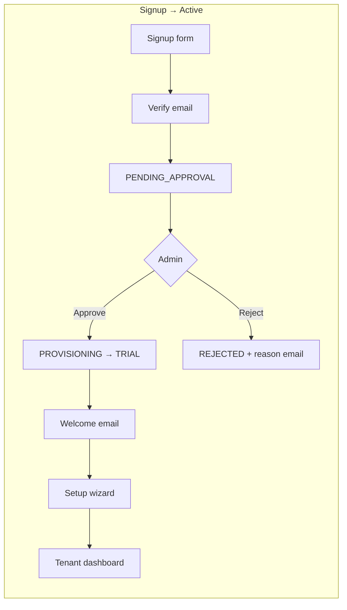
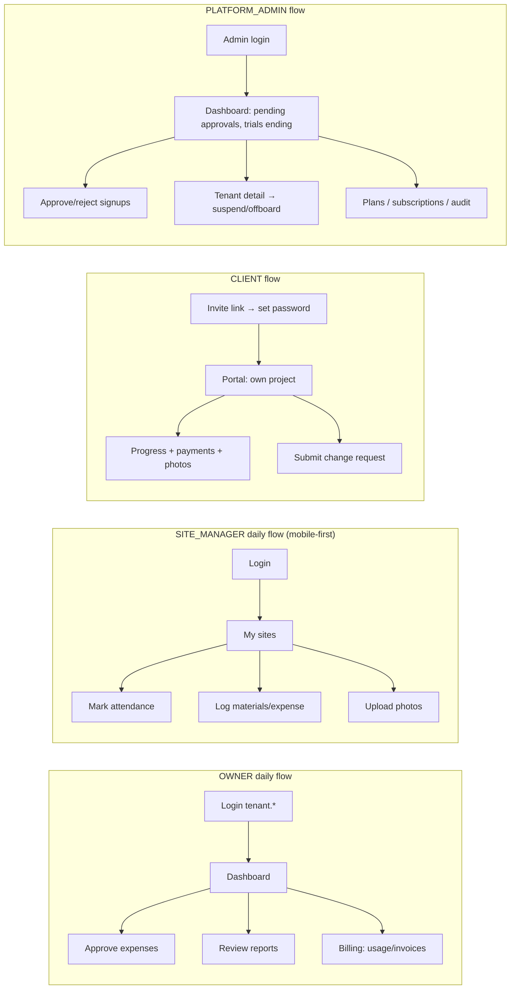

# Phase 01 — Information Architecture

## 1. Sitemap



## 2. Navigation Models

| Realm | Model | Items |
|-------|-------|-------|
| Public | Top nav | Logo · Features · Pricing · Login · "Start Free Trial" CTA |
| Platform console | Left sidebar (D-045) | Dashboard, Tenants, Approvals, Plans, Subscriptions, Settings, Audit · top-right user menu |
| Tenant app | Top navbar + horizontal tabs | Navbar: tenant logo/name, tenant badge, notifications, user menu → Profile / Billing (Owner) / Logout. Tabs: Dashboard, Sites, Quotations, Labor, Materials, Reports, Settings (+ Portal view for clients) |

## 3. Role-Based Entry Flows





## 4. Route Map (for dev)

```
Public:        /  /pricing  /signup  /login  /admin/login  /forgot-password  /invite/:token  /suspended
Platform:      /admin → dashboard  /admin/tenants  /admin/tenants/:id  /admin/approvals
               /admin/plans  /admin/billing  /admin/settings  /admin/audit
Tenant:        /dashboard  /sites  /sites/:id  /quotations  /quotations/:id  /quotations/new
               /labor  /materials  /reports  /settings  /users  /billing  /branding
               /wizard  /notifications  /portal (client)
Dev fallback:  ?tenant=<slug> or X-Tenant-ID header
```

**⏸️ Checkpoint:** IA sitemap, navigation models, and role flows as above.
