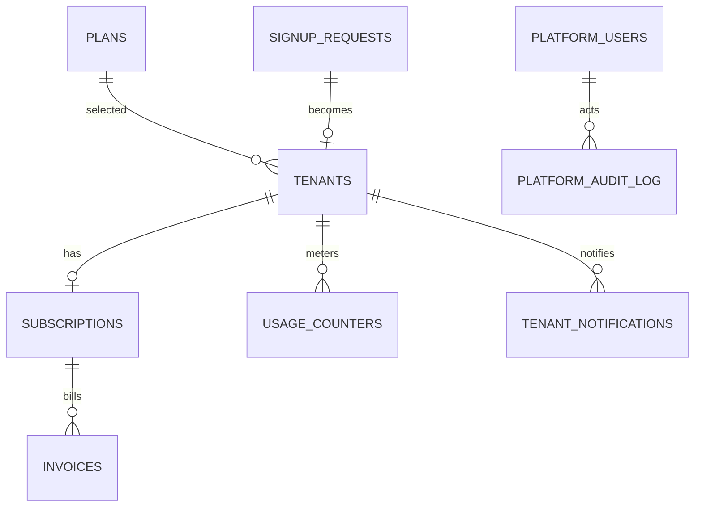
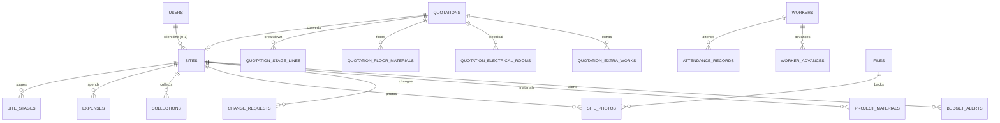

# Data Model — ElanjaiBuildos

## Isolation Model
Schema-per-tenant on PostgreSQL 16 (D-002). `public` = platform data; `t_<slug>` = tenant workspace (≤32-char names). Hibernate `MultiTenantConnectionProvider` sets `search_path` per request; tenant resolved from JWT `tenant_id` (authoritative) cross-checked vs Host subdomain (BR-016/020).

## Migrations
Flyway dual-track: `db/migration` → `public` (once); `db/migration-tenant` → each `t_*` (on provisioning + startup catch-up; per-schema `flyway_schema_history`). `ddl-auto=validate`. Schema-drift detection reported in admin console.

## Public Schema (platform)

| Table | Key fields |
|-------|-----------|
| tenants | id, company_name, slug UQ, schema_name UQ, owner_name/email, phone, gstin, state, status, plan_id FK, trial_ends_at, current_period_end, lifecycle timestamps |
| platform_users | id, email UQ, password BCrypt, name, role, active |
| plans | code UQ, name, price_monthly/yearly_inr, max_projects/staff_users/quotations_per_month, storage_gb, feature_flags JSONB, is_active, sort_order |
| subscriptions | tenant_id, plan_id, razorpay_subscription_id/customer_id, status, billing_cycle, period_start/end, cancel_at_period_end, scheduled_plan_id |
| invoices | invoice_number UQ (INV-YYYY-NNNNN), tenant_id, razorpay_payment_id, period, taxable/cgst/sgst/igst/total_inr, status, pdf_path, issued_at |
| signup_requests | company, owner, email, phone, password_hash, slug, gstin, state, plan_id, status, email_verified, reviewed_by/at, reject_reason |
| usage_counters | tenant_id, metric, period_key, value — UQ(tenant, metric, period) |
| platform_audit_log | actor_id, actor_role, action, entity_type/id, details JSONB, ip, created_at |
| platform_settings | key PK, value (platform GSTIN, state, reserved slugs, invoice seed, SMTP status) |
| tenant_notifications | tenant_id, channel(email/inapp), type, payload JSONB, sent_at, status |

## Tenant Schema `t_<slug>` (26 tables)

users, invites, sites, site_stages, quotations + quotation_stage_lines + quotation_floor_materials + quotation_electrical_rooms + quotation_extra_works (normalized per D-047), collections, expenses, material_spent, workers, daily_attendance + attendance_records, worker_advances, payment_summaries, materials, brands, packages, stage_templates, extra_works, material_calculations, project_materials, site_photos, change_requests, notifications, activity_logs, budget_alerts, files, tenant_settings.

## Key Decisions
- Quotation customization fully normalized (D-047) — queryable rows, not JSON blobs
- One client user per project via `sites.client_user_id` (D-049)
- Stage template copied to project then editable; must total 100% (D-050, BR-006)
- Files table = metadata; blobs on local volume keyed by tenant (D-048), S3 adapter seam
- Fresh start — no MySQL migration (D-007); dev seeds demo tenant (BR-025)

## Seed Data (per new tenant)
Default stage template (12 stages), 3 packages (basic/standard/premium), starter material + brand masters, default extra works. No demo transactional data.

## Lifecycle
- Delete: schema dropped at cancelled+30d (D-017); export ZIP during OFFBOARDING
- Audit/platform rows: 12 months; backups: daily all-schema pg_dump, 30d retention
- UTC storage, IST display (BR-023)

## Enums
TenantStatus(11) · SubscriptionStatus · BillingCycle · InvoiceStatus · PlatformRole(2) · UserRole(4) · QuotationStatus(6) · ProjectStatus · StageStatus · ExpenseCategory(5) · ApprovalStatus · PaymentMode · MaterialCategory(11) · WorkerType(8) · AttendanceStatus(4) · ChangeRequestStatus(5)/Type/Category · PackageType(4) · TaskType(8) · MetricKey(5)
